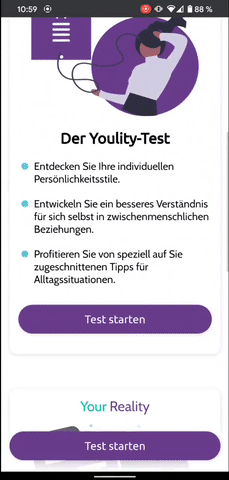
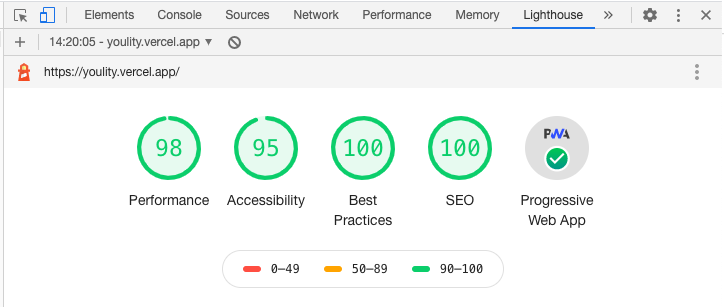

# Youlity - Discover Your Personality

This has been my capstone project ("Digitales Gesellenstück") for the web development bootcamp @ neue fische.

It's a progressive web app featuring an interactive questionnaire and a journal function. Highlights are a mobile-optimized UI with drag&drop and swipe gesture support. The app can be installed on used offline.
The app is responsive, however it is best viewed on a mobile device.

## Google Lighthouse results



## Tech-Stack

- React
- React Router
- Styled-Components
- Storybook
- Vercel

## Useful links

Test-URL (master): [https://youlity.vercel.app/](https://youlity.vercel.app/)

StoryBook Pattern Library: [https://master--5f6fbc1092d9510022f8d1f0.chromatic.com](https://master--5f6fbc1092d9510022f8d1f0.chromatic.com)

## Dev notes

To run this project locally just run

```
$ npm install
$ npm start
```
